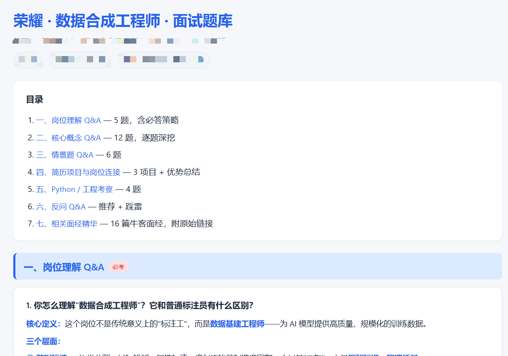

# AI 面试准备 · Interview Coach

> 一个面向 **AI Agent** 的面试陪练技能（Skill），兼容 OpenClaw、Codex CLI 及其他支持 SKILL.md 规范的 AI Agent 平台。

## 它能做什么

**核心：生成个性化面试题库，帮你真正理解岗位。**

**搜面经 + 生成题库** — 自动从牛客、知乎、GitHub 等平台**爬取面经**，学习提炼后生成一份**完全个性化**的面试题库 HTML。题库涵盖岗位理解、核心概念、情景题、行为/STAR 题、技术深度题、反问等，每一道题都结合你的**简历经历**和**实际面经**，不是通用模板。

**加强岗位理解与思考** — 不是让你死记硬背答案。每道题的参考答案都附有**思考框架**（为什么这么问、面试官想看什么），帮你真正理解这个岗位需要什么样的人、你的经历怎么对应上去。面经学习报告中提炼的**高频题清单 + 考察方向权重**，让你一眼看清该重点准备什么。

**陪你模拟面试** — 三种陪练模式，覆盖从系统复习到临场模拟的全流程。

- **📖 完整题库** — 爬取面经 → 结合简历 → 生成个性化 HTML 题库，拿去看和背
- **🎤 开口练** — AI 按面经高频题提问，你开口回答，连续追问 + 反馈评级
- **🎯 自定义** — 针对特定问题/场景自由练习

**费曼学习法追问** — 模拟严格面试官，连续追问直到挖透。不让你背稿，逼你用最简单的话说清楚复杂概念，暴露真正没搞懂的地方。

**不挑岗位** — 后端、算法、产品、运营、前端、数据科学……从 JD 自动推导核心概念和追问方向。

**不挑公司** — 大厂、外企、创业公司，三套不同的追问风格。

## 安装方法

在 Claude Code、Codex、OpenClaw 等支持 Skill 的 Agent 里，直接说：

> "帮我安装这个skill：https://github.com/shuoli0712/Interview-Q-A"

Agent 会自己 clone 到对应目录，不用你操心路径。

## 流程概览

```
收集岗位信息 + 简历 + 面经
       ↓
搜索学习面经（自动推导关键词）
       ↓
产出面经学习报告（高频题 / 考察方向 / 特殊提示 / 项目连接点）
       ↓
┌──────┼──────┐
↓      ↓      ↓
题库  开口练  自定义
```

## 报告示例



> 模式一生成的完整题库 HTML 页面截图，包含岗位理解、核心概念、情景题、行为题、面经高频题、反问等模块，可直接在浏览器中阅读和打印。

## 三种模式

| 模式 | 说明 | 适合谁 |
|------|------|--------|
| 📖 **题库** | 把岗位理解、核心概念、情景题、行为题、反问等打包成 HTML | 想系统复习的人 |
| 🎤 **开口练** | AI 按面经高频题提问，你开口答，连续追问 + 反馈评级 | 想模拟真实面试的人 |
| 🎯 **自定义** | 针对特定问题/场景自由练习 | 有明确薄弱点的人 |

## 快速开始

准备三样东西，然后对 AI 说 **"帮我准备面试"**：

1. **岗位信息** — 公司名 + 岗位名 + JD（链接或原文）
2. **个人简历** — 教育背景、项目经历、实习、技能栈
3. **面经链接**（可选） — 你有收藏的话，第一优先级

AI 会自动跑完整流程，最后让你选模式。

## 红线

- 必须先收集信息再动手
- 必须让用户选择模式，不能替用户决定
- 不要编造面经，没搜到就说没搜到
- 不要替用户写逐字稿，给框架让用户用自己的话说

## License

MIT
